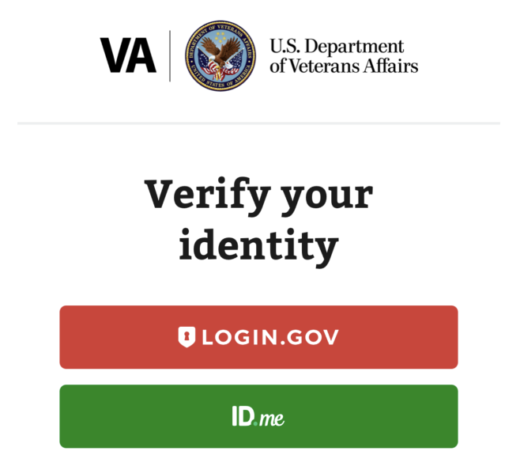
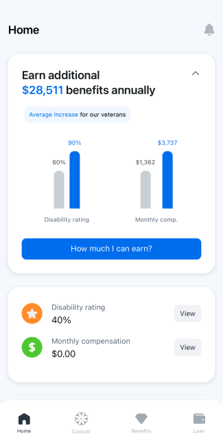

# Vugle-Health

## Table of Contents
- [Overview](#overview)
- [Problem Statement](#problem-statement)
- [Mission](#mission)
- [Features](#features)
- [Technical Details](#technical-details)
- [Getting Started](#getting-started)
  - [Accessing the Application](#accessing-the-application)
  - [Diagnosing Your Medical Conditions with Dex](#diagnosing-your-medical-conditions-with-dex)
  - [Make Doctor's Appointment with Dex](#make-doctors-appointment-with-dex)

## Overview
`Vugle` is an `AI-integrated application` designed to provide **personalized financial assistance** and **healthcare benefit support** to **_active duty U.S. military personnel and veterans._** By leveraging **_AI technology,_** Vugle `educates veterans on their entitlements`, `simplifies the benefits application process`, and `expedites claim submissions`, ensuring veterans **receive the financial and health benefits they deserve**.

## Problem Statement 
`Veterans` in the U.S. face `significant barriers` when accessing their `benefits`: 
- **_Cumbersome Application Processes_**
  - Filing disability claims `requires` **extensive documentation** and is often `delayed` by administrative inefficiencies. In **2023** alone, VA received `1.9 million claims` with a `backlog of 300,000.` This means veterans **cannot** immediately `access disability compensations.`
- **_Lack of Awareness_**
  - Many veterans are `unaware` of their **eligibility for various benefits.** Reports show that `51%` of veterans have **never used** their `entitlements post-discharge.` 
- **_Limited Support Infrastructure_**
  - `Veteran Service Organizations (VSOs)` and other support systems are stretched thin, leading to **long wait times** and **insufficient assistance.** 

## Mission 
`Vugle` aims to streamline `financial assistance` for **American active duty military personnel.** We `achieve` this by `simplifying` the **benefits claim process** and referring them to other benefits.

**`Our vision is to ensure that no veteran is left behind. That every veteran receives the full benefits they deserve.`**

## Features
`Vugle` offers a robust suite of tools designed to `assist` veterans in navigating the **benefits process** with `ease` and `efficiency:`
1. **Secure Login**
    - Vugle-Health integrates `OAuth` and `OpenID Connect` authentication through the **official VA.gov site,** for secure and reliable login experience for veterans. This implementation leverages the `Authorization Code Grant flow` for enhanced security.

2. **AI Chabot: Dex**  
    - `Dex` is Vugle’s main feature—an `AI-integrated chatbot` designed to **simplify the disability claim process** and **educate veterans**.
      - `Dex` analyzes veterans' **medical records** and collects their current **medical conditions** to **_identify_** `potential medical conditions` and `most suitable claim types`. It offers personalized assistance, making the **claims process faster and more intuitive.**

3. **Streamlined Application Process**  
    - `Vugle` **automates** the `retrieval` and organization of `essential data` **_to improve the accuracy and efficiency of disability claims._**
      - It `fetches` relevant information through `OAuth authentication` and `parses veterans' DD214 forms` (military service documentation) **to identify the most suitable claim type** and **maximize their compensation rating.**

4. **Web & Mobile Compatibility**
   - `Vugle` ultimately aims to **shift the perception of the disability claim process** from being `complicated` to being `straightforward` and `accessible` for veterans. To achieve this, `Vugle` is designed as a `native mobile application.`
     - To `showcase` that claims can be **easily processed** via a `mobile app`, `Vugle` **detects** the `user's device` and `adapts` its interface to **present a mobile-friendly UI,** even for users accessing the platform via the `web.`
## Technical Details

### Tech Stack
- **Backend:** `Django (Python)`
- **Frontend:** `React Native Expo (TypeScript)`
- **Deployment:** `AWS Elastic Beanstalk (Backend)`, `AWS Amplify (Frontend)` 

### System Architecture
The system is designed with a **cohesive yet decoupled architecture** for scalability, maintainability, and a clear separation of concerns.

#### Backend
- Built with `Django` and `Django REST Framework (DRF)` to provide **RESTful APIs**.
- **API Integrations**: `Fetches` data from `VA API` using **OAuth** for thorough claim processing and detailed analysis.
- **OAuth2 and OpenID Connect Integration**: Implements secure login and `token validation` using **VA.gov's Authorization Code Grant flow**.
- **AI Integration**: Utilizes the `OpenAI` `API` to **analyze** **potential medical conditions** and **recommend** the most suitable `claim types` based on user data and inputs.
- **Document Parsing**: Processes `DD214` forms using `Google Cloud's Document AI` to **extract** essential service-related data for `claims analysis`.
- **Session Management**: Handles user **authentication data** and **session-specific information** across user interactions.

#### Frontend
- Built with `React Native Expo` to provide consistent experience across `mobile` and `web` platforms.
- **Reusable Components**: Structured `modular architecture` with `reusable` components for better **maintainability** and **scalability**.
- **API Integration**: `Communicates` with the `backend` to **store** user inputs, **retrieve** specific data through `HTTPS API` `endpoints`.
- **Chatbot Interface**: Implements a structured and interactive chatbot, `Dex`, to **guide** users through the `process` of `disability claims`. `Dex` dynamically **renders** elements such as `text prompts`, `images`, and interactive `options` based on **JSON-driven configuration**.
- **State Management**: Manages `Dex` **state** and `user` **interactions** with `useReducer` to `handle` the **chat flow** and `maintain` a structured **history of user responses**.

## Getting Started

## Accessing the Application

After you click “VA Continue with VA.gov”, you will see below page:

  

<em>Figure 1: Authentication Login Page</em>

You may use below information to begin the application. 

### Logging in with ID.me (Recommended)
To log in to the sandbox environment using ID.me:
1. Enter the ID.me email from the Test User table.
   - The password for all ID.me test accounts is: **SandboxPassword2024!**
2. When asked about receiving an authentication code, don't change any preselected answers. Just click **Continue** to proceed to the next step.

### Logging in with Login.gov
To log in to the sandbox environment using Login.gov:
1. Enter the Login.gov email from the Test User table.
   - The password for all Login.gov test accounts is: **Password12345!!!**
2. Use the Login.gov MFA seed to generate a 2FA code with an app such as Google Authenticator or Authy.

### Test User Table

| First Name | Last Name | ID.me                                      | Login.gov                                                        |
|------------|-----------|-------------------------------------------|------------------------------------------------------------------|
| Tamara     | Ellis     | Email: va.api.user+001-2024@gmail.com      | Email: va.api.user+001@gmail.com   2-Factor Seed: LKI7FZ7ZEVRLGQRW |
| Janet      | Moore     | Email: va.api.user+002-2024@gmail.com      | Email: va.api.user+002@gmail.com   2-Factor Seed: B5C3L42PLUWO3U5T |
| Ralph      | Lee       | Email: va.api.user+003-2024@gmail.com      | Email: va.api.user+003@gmail.com   2-Factor Seed: DIN72VD3MUOWJEENIS2FTJZEAROTGBAC |
| Sheba703   | Harris789 | Email: va.api.user+101-2024@gmail.com      | Email: va.api.user+101@gmail.com   2-Factor Seed: BNBV63ON5ST7BHSU |

## After Logging In

After you log in, you will see the page shown below.

You can click the **“How much I can earn?”** or **“Consult”** button in the footer to begin the AI-assisted Dex service.

  

<em>Figure 2: Home Page</em>

---

## About Dex

Dex is an AI-powered tool that provides personalized analysis for veterans. It helps determine the best suitable claim type based on:
- **Service treatment records**
- **Medical records**
- **Previous claims**
- **DD214 file**

These records are securely fetched via **OAuth login**. Using different user accounts will cause different results. 

---

## Enhanced Analysis with DD214

Dex includes an advanced functionality to parse relevant data from uploaded **DD214 files**. This data is incorporated into the analysis for even more accurate recommendations.

### Steps:
1. Dex will prompt you to upload your **DD214 file**.
   - You can upload your DD214 file for enhanced analysis.
   - Alternatively, click **“I do not have it”** to proceed without uploading.
2. For demonstration purposes, you can use the provided sample file:  
   **[DD214-Example.pdf](#)**

Dex will analyze the relevant information in the DD214 file to recommend the most suitable claim type for you. 

 

<strong>What is the relevant information used?</strong>

### Relevant Data Parsed from DD214

Below are the key fields extracted from the DD214 document using the parsing logic:

1. **Department, Component, and Branch**  
   - Section 2: Extracts the military department and branch information (e.g., "Air Force").

2. **Grade, Rate, or Rank**  
   - Section 4a: Extracts the rank held by the veteran (e.g., "CAPT").

3. **Pay Grade**  
   - Section 4b: Extracts the pay grade associated with the veteran's rank (e.g., "D3").

4. **Date Entered Active Duty**  
   - Section 12a: Extracts the date the veteran entered active duty (formatted as Year, Month, Day).

5. **Separation Date**  
   - Section 12b: Extracts the date the veteran was separated from active duty (formatted as Year, Month, Day).

6. **Net Active Service**  
   - Section 12c: Extracts the net active service time during the period (Years, Months, Days).

7. **Total Foreign Service**  
   - Section 12f: Extracts the total time spent in foreign service (Years, Months, Days).

8. **Primary Specialty**  
   - Section 11: Extracts the primary military specialty title and duration (e.g., "64P3, Contracting, 5 Years and 4 Months").

9. **Decorations, Medals, and Awards**  
   - Section 13: Extracts the list of awarded decorations, medals, badges, and citations (e.g., "Air Force Commendation Medal").

10. **Military Education**  
    - Section 14: Extracts the titles and durations of completed military education (e.g., "Fundamentals of Systems Planning").

11. **Remarks**  
    - Section 18: Extracts additional comments and remarks regarding the veteran's service.

12. **SGLI Coverage**  
    - Section 10: Extracts the Servicemembers’ Group Life Insurance coverage amount (e.g., "$400,000").

---

## Diagnosing Your Medical Conditions with Dex

To begin, choose one of the following options: **“New condition”**, **“Existing condition”**, or **“Both”**, depending on your situation. Once selected, Dex will start diagnosing your current medical conditions and analyzing:

1. **Potential related conditions**  
2. **The most suitable claim type** you may want to file.

**Please assume you are a veteran who is filing a disability claim!**

You can type any medical condition into the system. For example:  
- *“I am having trouble sleeping.”*  
- *“I feel numbness or tingling in my lower leg or foot.”*  

Based on the conditions you provide, Dex will analyze whether they are associated with your previous service history or medical records.

  
<strong>Example Fetched User Data</strong>

If you log in using Tamara Ellis' account, this user has below data:  
- **Diagnosed Conditions**:
  - Paralysis of the sciatic nerve
  - Post-Traumatic Stress Disorder (PTSD)

You can view detailed information about the user by clicking the **“View”** button next to **Disability rating** and **Monthly compensation** on **Figure 2: Home Page**.

Therefore, if you are logged in via Tamra Ellis’ account and submitted medical conditions related to **Paralysis of the sciatic nerve** or **Post-Traumatic Stress Disorder**, Dex will analyze your data and recommend filing an **Increased Claim** or a **Secondary Service-Connected Claim**.

---
### Maximizing Your Disability Rating with Dex

Dex will evaluate your medical conditions and health records to suggest **Potential Related Conditions**. You can then:

1. Click **“Let’s check”** to view the potential related conditions.
   - Please allow a few seconds after clicking **“Let’s check”** for Dex to analyze and provide the potential related conditions!
2. Add any conditions you believe you also have!  

By doing so, Dex will consult users on how to maximize their disability rating and ensure they claim all eligible benefits.

---

### Now, allow Dex to analyze the most suitable claim type!

After completing the Basic Assessment with Dex, Dex will begin reviewing the veteran’s data to determine the most suitable claim type.

Click **“View result”** only once, and please allow a few seconds after clicking  **“Let’s check”** for Dex to analyze and provide the most suitable claim type!

---

### Make doctor’s appointment with Dex

1. Click **“View medical centers”** to see available VA medical centers.  
   - You can select any listed VA medical center to proceed.  

2. After selecting a medical center, click **“Schedule an appointment”** to begin the appointment process.

3. You will see the **Patient Information** section.  
   - You may edit the patient information by clicking the **edit (TODO: replace with actual icon SVG)** icon.

4. Complete the appointment process by clicking the **“Continue”** button.  
   - Dex will display a branch of medicine based on your typed medical conditions and generate a message for the doctor on your behalf.

5. Finally, click **“Confirm and schedule”** to complete the process.  
   - This is the end of our Vugle prototype! 😊

